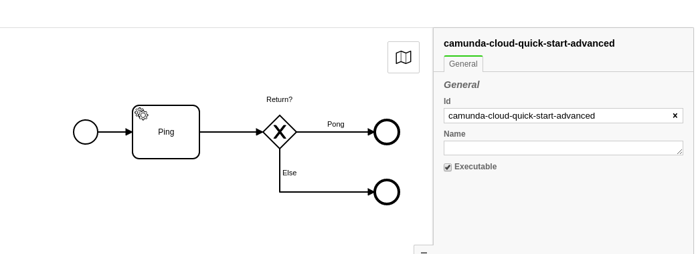
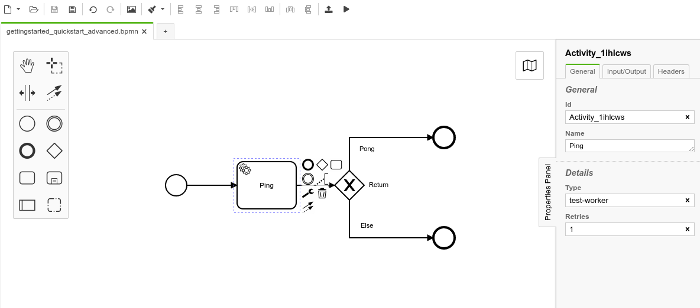
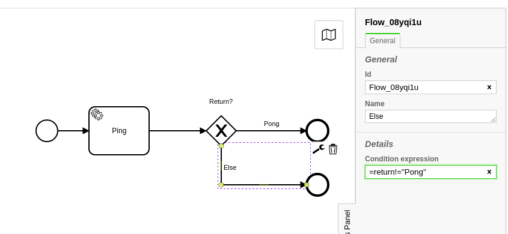
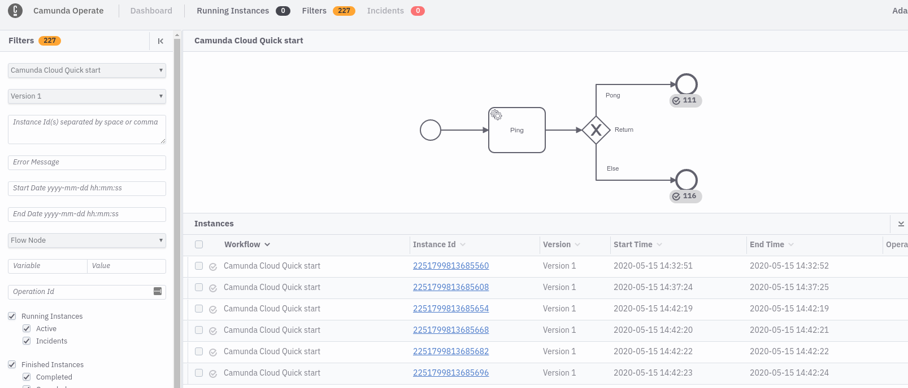

Prerequisite: [Quick Start](./gettingstarted_quick-start.md)

This tutorial shows you how to register a worker with `zbctl` and use it in your workflow.

## Install `zbctl`

`zbctl` is the command line tool that allows you to interact with a Zeebe Broker. Install `zbctl` via [npm](https://www.npmjs.com/package/zbctl):

```bash
npm i -g zbctl
```

Print the version to make sure that `zbctl` was installed:

```bash
zbctl version
```

In [Quick Start](./gettingstarted_quick-start.md) you've already created a cluster and a client. We'll also use these for this tutorial.

## Advanced Workflow
Use [This workflow model](./assets/gettingstarted_quickstart_advanced.bpmn) for the tutorial or adjust your previous model as followed:

If you click on the canvas and look at the properties panel you can set the process name and the process Id. Later the bpmn id is important to start an instance on your process. The name will appear in Operate. If you have not set a name, Operate will use the ID. It is recommened to change the ID to something readable.



For our advanced workflow we include a Service Task and a XOR Gateway. Select the Service Task and fill in the properties. The jobs from that task should be processe by the worker `test-worker`.



The worker will return a JSON object as a result, which is used to decide which path to take. In order to use the result to route your process fill in the condition expression on the two sequence flows after the XOR gateway. Use the following expression for the "Pong" sequence flow: 
```bash
=return="Pong"
```
And for the Else Sequence flow:
```bash
=return!="Pong"
```




## Deploy workflow with zbctl

Go back to your cloud account and select your created cluster. Navigate to the client section of the cluster details. Use the button `Show connection info` to display all needed export statements for environment variables. 

Set the environment variables accordingly to your operation system. 

OR use the [described flags](https://www.npmjs.com/package/zbctl#usage) `--address`, `--clientId` and `--clientSecret`). with the zbctl commands

Test the connection by printing out the topology (after setting the enviroment variables):

```bash
zbctl status
```

OR if you haven't set the environment variables use the following pattern: 
```bash
zbctl status --address xxxxx --clientId xxxxx --clientSecret xxxxx
```

As a result, you should see:

```bash
Cluster size: 1
Partitions count: 1
Replication factor: 1
Gateway version: 0.23.1
Brokers:
  Broker 0 - zeebe-0.zeebe-broker-service.0e65413b-cc0d-4b9a-9bfb-7b30f81a739a-zeebe.svc.cluster.local:26501
    Version: 0.23.1
    Partition 1 : Leader
```

Now you can deploy the [workflow](./assets/gettingstarted_quickstart_advanced.bpmn). Navigate to the folder, where you saved your workflow. 

```bash
zbctl deploy gettingstarted_quickstart_advanced.bpmn
```

If the deployment is successful you'll get the following output:

```bash
{
  "key": 2251799813685493,
  "workflows": [
    {
      "bpmnProcessId": "camunda-cloud-quick-start-advanced",
      "version": 1,
      "workflowKey": 2251799813685492,
      "resourceName": "gettingstarted_quickstart_advanced.bpmn"
    }
  ]
}
```

Important here is the `bpmnProcessId`, which you'll need for creating a new instance.

## Register a worker

The workflow uses the worker with the type `test-worker`. Register a new one by using the following command:

```bash
zbctl create worker test-worker --handler "echo {\"return\":\"Pong\"}"
```

## Start a new instance

Starting a new instance is done with a single command:

```bash
zbctl create instance camunda-cloud-quick-start-advanced
```

As a result, you'll get the following output, which contains, among others, the `workflowInstanceKey`:

```bash
{
  "workflowKey": 2251799813685492,
  "bpmnProcessId": "camunda-cloud-quick-start-advanced",
  "version": 1,
  "workflowInstanceKey": 2251799813685560
}
```

Navigate to Operate to monitor the workflow instance.


Because the worker returns

```json
{
  "return": "Pong"
}
```

the workflow ends in the upper end event.

Changing the worker to

```bash
zbctl create worker test-worker --handler "echo {\"return\":\"...\"}"
```

and creating a new instance leads to a second instance in Operate ending in the second end event:


As a next step you can now connect both workers in parallel and create more workflow instances:

```bash
while true; do zbctl create instance camunda-cloud-quick-start-advanced; sleep 1; done
```

In Operate you will see instances ending in both end events depending on which worker picked up the job.


